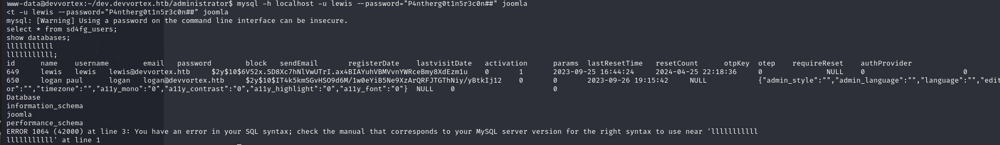
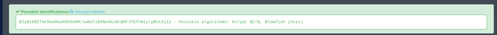

# Devvortex

IP: `10.10.11.242`

## Nmap Scan
ran `nmap -sV IP`

From the nmap scan we can see that port 22 and port 80 are open which means ssh is available and there is also a website being hosted.

## Devvortex Website
Since port 80 was open I decided to navigate to the website being hosted there and it looked like this

My first instict was to look for hidden paths such as /admin and /login but those yielded no results.
I then tried to automate this process with a tool called `dirbuster`. This unfortunately yielded no results as well.
So, I then looked into possible subdomains. To check theses I used a tool called `ffuf`. I downloaded a list of [subdomains](https://github.com/rbsec/dnscan/blob/master/subdomains-10000.txt) from github and used ffuf to check all of them.

FFuF revealed to me that there was a `dev` subdomain.

## Dev Subdomain
Upon navigating to dev subdomain I was greeted with the following page.

I repeated the same process in the previous step where I randomly tried paths and got lucky that there was a `/administrator` path.

## Joomla Admin Login
I first tried some basic username and password pairs like `admin:admin`, `root:root`, `admin:password`. All of these failed. 
My next thought was to brute force the login credentials using a tool called `hydra`. Not only was this slow but it proved ineffective so I needed to rethink my strategy. 
Eventually I noticed in Kali there was a link to something called [Exploit Database](https://www.exploit-db.com/). So, I went there and searched for Joomla and sure enought there were lots of CVEs posted there. As I was looking at the CVEs I saw one with a green checkmark and chose that one to look at.

Upon clicking on it, I saw that it was a vulenrability that leaked information. So, I thought this might work and copied the links in the exploit it gave which were   
`#{root_url}/api/index.php/v1/users?public=true` and `#{root_url}/api/index.php/v1/config/application?public=true`   
When I replaced the root url with the `dev.devvortex.htb` url and submited it in the search bar I got back the username in the first link and the password in the second.

## Reverse Shell
Upon entering the admin portal my first thought was to upload a reverse shell. So, I naviagted to where the files were located and added a line of php code that gave me a reverse shell. The shell I used was from this random github repo [PHP reverse Shell](https://gist.github.com/rshipp/eee36684db07d234c1cc).

I then navigate to the home folder and found a user named logan with a file called `user.txt` which I am assuming is the flag. I tried to cat the file but I did not have the proper permissions. So, I then used `mysql` to login to the database and get the password for logan.

For some reason mysql would not resond so I just kept hitting random keys until it printed the users which is why there are random spaces and letters in the screenshot. However, we eventually got the password for logan. sort of. Unfortunately it is hashed. 

## Password Hash
I looked up the hash online and found that it is a bcrypt, blowfish unix password. So, my first thought is to use hashcat to try and crack the hash as I used this program in cs 483.

After running the hash through hashcat using the `rockyou.txt` dictionary that comes with Kali I was able to crack the hash. I did run this on my machine however as it was very slow using the VM.

## Privilege Escalation: Logan
With the password I have recovered I am now able to switch to logans account using `su logan` in the reverse shell from earlier.  

## Privilege Escalation: Root
Since we are now logged into Logan's account, we need to find some way to upgrade our permissions to root. I have no idea how to do this so I started watching some videos on privilege escalation on YouTube. I came across this [video](https://www.youtube.com/watch?v=X80XZMeN7oU) which says that you can do `sudo -l` to see which programs a user is allowed to run as sudo. So, I did that and found that Logan can execute a program called `apport-cli` as sudo. 

